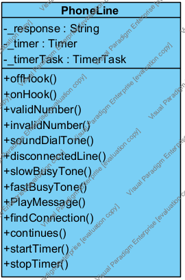
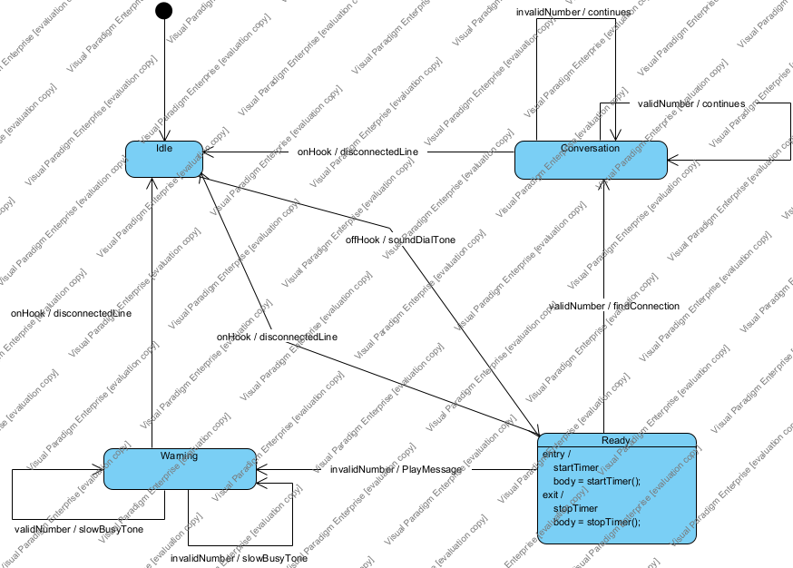

# Отчёт о лабораторной работе

**Автор:** Шабанов Валентин Дмитриевич

**Группа:** МСТПР241

---

## 1. Диаграмма классов



В Visual Paradigm была создана диаграмма классов, включающая класс `PhoneLine` со следующими компонентами:

**Атрибуты:**
- `_response: String` — хранит последнюю реакцию системы
- `_timer: Timer` — таймер для отслеживания таймаутов
- `_timerTask: TimerTask` — задача таймера

**Методы событий (входы):**
- `offHook()`, `onHook()`, `validNumber()`, `invalidNumber()`

**Методы действий (выходы):**
- `soundDialTone()`, `disconnectedLine()`, `findConnection()`, `continues()`, `PlayMessage()`, `slowBusyTone()`

**Методы управления таймером:**
- `startTimer()`, `stopTimer()`

---

## 2. Диаграмма состояний



Система моделирует работу телефонной линии с четырьмя состояниями:

- **Idle** — телефон на крючке (начальное состояние)
- **Ready** — трубка снята, ожидание набора номера (с таймаутом 3 единицы времени)
- **Conversation** — активный разговор
- **Warning** — предупреждение о неправильном действии

---

## 3. Генерация кода из UML-модели

С использованием Visual Paradigm был автоматически сгенерирован код на Java. Основные сгенерированные файлы:

- [`PhoneLine.java`](PhoneLine.java) — основной класс системы
- [`PhoneLineContext.java`](PhoneLineContext.java) — контекст конечного автомата
- [`FSMContext.java`](FSMContext.java) — базовый класс FSM
- [`State.java`](State.java) — интерфейс состояния
- [`PhoneLine.sm`](PhoneLine.sm) — описание автомата в формате SMC

### 3.1 Доопределение методов

После генерации все методы в классе `PhoneLine.java` были реализованы вручную:

**Методы-входы** возвращают строковое значение реакции системы:
```java
public String offHook() {
    _fsm.offHook();
    return _response;
}
```

**Методы-действия** устанавливают значение атрибута `_response`:
```java
public void soundDialTone() {
    _response = "soundDialTone";
}
```

### 3.2 Реализация механизма таймаута

Для поддержки таймаутов были реализованы методы управления таймером. Состояние **Ready** автоматически вызывает `startTimer()` при входе и `stopTimer()` при выходе.

**Метод запуска таймера:**
```java
public void startTimer() {
    _timer = new Timer();
    _timerTask = new TimerTask() {
        @Override
        public void run() {
            // Выполняем выход из текущего состояния
            (_fsm.getState()).Exit(_fsm);
            _fsm.clearState();

            // Переходим в состояние Warning
            _fsm.setState(PhoneLineContext.PhoneLineFSM.Warning);

            // Выполняем вход в новое состояние
            (_fsm.getState()).Entry(_fsm);
        }
    };
    // Таймер на 300 мс (3 кванта по 100 мс)
    _timer.schedule(_timerTask, 300);
}
```

**Метод остановки таймера:**
```java
public void stopTimer() {
    if (_timerTask != null) {
        _timerTask.cancel();
        _timerTask = null;
    }
    if (_timer != null) {
        _timer.cancel();
        _timer.purge();
        _timer = null;
    }
}
```

При выходе из состояния **Ready** таймер автоматически останавливается, предотвращая ложное срабатывание таймаута.

---

## 4. Построение конечно-автоматной абстракции

### 4.1 Доопределение автомата

Для применения формальных методов тестирования автомат был доопределён: для каждой неопределённой пары (состояние, событие) был добавлен переход-петля с выходом `nul` (отсутствие реакции).

**Пример доопределения:**
- В состоянии `Idle` событие `validNumber` изначально не определено
- Добавлен переход: `Idle --validNumber/nul--> Idle`

Это обеспечивает полноту спецификации автомата для генерации тестов.

**Таблица переходов доопределённого автомата:**

| Event/State     | Idle           | Conversation             | Warning                | Ready                      |
|-----------------|----------------|--------------------------|------------------------|----------------------------|
| **onHook**      | Idle / nul     | Idle / disconnectedLine  | Idle / disconnectedLine| Idle / disconnectedLine    |
| **offHook**     | Ready / soundDialTone | Conversation / nul    | Warning / nul          | Ready / nul                |
| **validNumber** | Idle / nul     | Conversation / continues | Warning / slowBusyTone | Conversation / findConnection |
| **invalidNumber**| Idle / nul    | Conversation / continues | Warning / slowBusyTone | Warning / PlayMessage      |
| **timeout**     | -              | -                        | -                      | 3 → Warning                |

### 4.2 Проблема моделирования таймаутов

Стандартные методы тестирования конечных автоматов не поддерживают непрерывное время. Для решения этой проблемы был использован метод FSM абстракции.

### 4.3 Метод абстракции

Введён специальный символ **I** (idle):
- **Вход I:** отсутствие событий в течение 1 кванта времени (100 мс)
- **Выход I:** отсутствие реакции

Таймаут на 3 кванта моделируется цепочкой промежуточных состояний:

```
Ready --I/I--> Ready_1 --I/I--> Ready_2 --I/I--> Warning
```

### 4.4 Таблица переходов абстрактного автомата

| Event/State     | Idle      | Conversation         | Warning            | Ready                | Ready_1              | Ready_2              |
|-----------------|-----------|----------------------|--------------------|----------------------|----------------------|----------------------|
| **onHook**      | Idle / nul| Idle / disconnectedLine | Idle / disconnectedLine | Idle / disconnectedLine | Idle / disconnectedLine | Idle / disconnectedLine |
| **offHook**     | Ready / soundDialTone | Conversation / nul | Warning / nul | Ready / nul | Ready / nul | Ready / nul |
| **validNumber** | Idle / nul| Conversation / continues | Warning / slowBusyTone | Conversation / findConnection | Conversation / findConnection | Conversation / findConnection |
| **invalidNumber**| Idle / nul| Conversation / continues | Warning / slowBusyTone | Warning / PlayMessage | Warning / PlayMessage | Warning / PlayMessage |
| **I**           | Idle / I  | Conversation / I     | Warning / I        | Ready_1 / I          | Ready_2 / I          | Warning / I          |

---

## 5. Описание FSM для генерации тестов

На основе построенной конечно-автоматной абстракции был создан файл [`fsm.txt`](fsm.txt) в специальном формате для сайта fsmtestonline.ru:

```
F 0
s 6 Idle Conversation Warning Ready Ready_1 Ready_2
i 5 onHook offHook validNumber invalidNumber I
o 8 nul disconnectedLine soundDialTone continues findConnection slowBusyTone PlayMessage I
n0 Idle
p 30
Idle onHook Idle nul
Idle offHook Ready soundDialTone
...
Ready_2 I Warning I
```

**Формат:**
- `F 0` — полностью определённый автомат
- `s 6` — количество состояний (с именами)
- `i 5` — количество входных символов
- `o 8` — количество выходных символов
- `n0 Idle` — начальное состояние
- `p 30` — количество переходов (6 состояний × 5 входов)

Далее следуют переходы в формате: `состояние_откуда событие состояние_куда выход`

---

## 6. Генерация тестов

Файл `fsm.txt` был загружен на сайт https://fsmtestonline.ru, где с использованием **HSI-метода** была сгенерирована тестовая последовательность из 47 тестовых случаев.

Полученные тесты сохранены в файле [`fsm_tests.txt`](fsm_tests.txt).

**Примеры сгенерированных тестов:**

```
offHook/soundDialTone onHook/disconnectedLine
offHook/soundDialTone validNumber/findConnection onHook/disconnectedLine
offHook/soundDialTone I/I I/I I/I onHook/disconnectedLine
```

---

## 7. Реализация JUnit-тестов

### 7.1 Преобразование тестовых последовательностей

Сгенерированные тестовые последовательности были преобразованы в JUnit-тесты (см. [`PhoneLineTest.java`](PhoneLineTest.java)).

**Правила преобразования:**
- Каждый символ `I/I` преобразуется в `Thread.sleep(100)` (квант времени = 100 мс)
- События преобразуются в вызовы соответствующих методов
- Выходы проверяются через `assertEquals()`

### 7.2 Обработка nul-переходов

Сгенерированные тесты содержали проверки недопустимых переходов с выходом `nul`. Эти переходы были добавлены при доопределении автомата для полноты спецификации, но отсутствуют в оригинальной модели.

При попытке выполнить недопустимый переход сгенерированный код выбрасывает `TransitionUndefinedException`, что приводило к падению тестов.

**Решение:** Из тестов были удалены все проверки переходов с выходом `nul`. Если тест состоял полностью из таких переходов, он удалялся целиком.

Переходы с выходом `nul` были введены искусственно на этапе доопределения автомата — они нужны для создания полной FSM спецификации, необходимой генератору тестов. В реальной системе, описанной UML-диаграммой, такие переходы просто не существуют. Сгенерированный Visual Paradigm код правильно отражает эту логику, выбрасывая исключение при попытке выполнить неопределённое действие. Задача тестирования состоит в проверке корректности реализации заданного автомата, а не в проверке обработки ошибочных входных данных. Удаление проверок недопустимых переходов никак не влияет на качество тестового покрытия — все реальные переходы системы остаются протестированными.

**Исходная версия тестов** (с проверками `nul`-переходов, вызывающими `TransitionUndefinedException`) сохранена в ветке [`transition_errors`](../../tree/transition_errors).

**Пример адаптации теста:**

Исходный тест:
```
offHook/soundDialTone offHook/nul onHook/disconnectedLine
```

Адаптированный тест:
```java
@Test
public void testCase3() {
    assertEquals("soundDialTone", phone.offHook());
    // offHook/nul - удалён
    assertEquals("disconnectedLine", phone.onHook());
}
```

### 7.3 Итоговая статистика

- **Всего сгенерировано тестов:** 47
- **Реализовано:** 40 (7 тестов были удалены из-за nul-переходов)
- **Тесты таймаута:** 2 (testCase43_Timeout и testCase44_Timeout)
- **Все реализованные тесты успешно выполняются**

---

## 8. Результаты и выводы

В ходе выполнения лабораторной работы были получены следующие результаты:

1. Создана полная UML-модель системы телефонной линии
2. Реализован рабочий код на Java с поддержкой таймаутов
3. Построена FSM абстракция для автомата с непрерывным временем
4. Сгенерированы тесты с использованием формального HSI-метода
5. Реализовано 40 JUnit-тестов с покрытием всех реальных переходов автомата